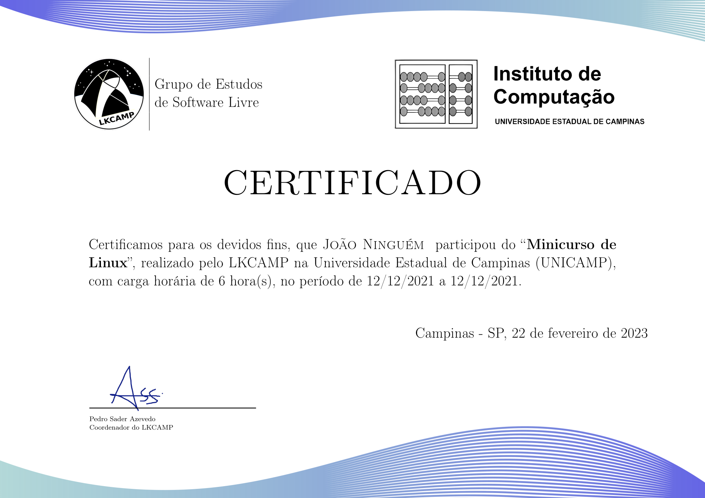

# CertificaTeX

Easily generate participation certificates, powered by LaTeX.

## How to use this repository

### Customizing

1. Fork this repository
2. Clone your fork
3. Create a new branch
4. Tweak the [`main.tex`](./main.tex) to match your event
5. Add participants' names to [`names.txt`](./names.txt), one per line

### Building

#### Github Actions

If you commit and push your changes to GitHub, all certificates will be automatically built and will be available to download as an artifact of the latest pipeline.

#### Gitlab CI

If you commit and push your changes to an instance of GitLab that has this feature enabled, all certificates will be automatically built and will be available to download as an artifact of the latest pipeline.

#### Locally

To build locally, you may run the [`build.sh`](./build.sh) script on the container image ghcr.io/pesader/toolbxes:tex. If you prefer not to use containers, you will need to install all dependencies manually.

## Credit

Most of the heavy-lifting was done by Clebson dos Santos Marques, who created the [template](https://www.overleaf.com/latex/templates/gerador-de-certificados-e-declaracoes/vznwmscnzqyb) which this project was based on.

## License

This project is licensed under the GPLv3.
